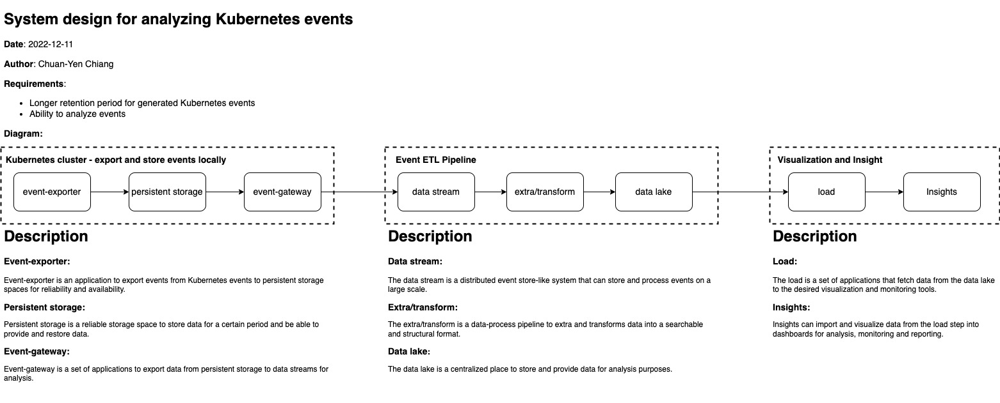

# tsmc interview

A system to export and analysis Kubernetes events.
Requirements:

- Longer retention period for generated Kubernetes events
- Ability to analyze events

## Requirements:

- terraform: 1.3.6
- kind: v0.17.0
- kustomize: v4.5.7
- envsubst: 0.21.1
- AWS credentials and put it into environment variables as following:
  ```bash
  export TF_VAR_access_key=${AWS_ACCESS_KEY}
  export TF_VAR_secret_key=${AWS_SECRET_KEY}
  export TF_VAR_region=${AWS_REGION}
  ```
    
## System Overview



The system contains three parts:

- **Kubernetes**: Collecting events and export to ETL Pipeline
- **ETL Pipeline**: Process events and store in a reliable centralized storage
- **Insights**: Ability to run queries to analyze events

## How to use

The following steps are tested in the MacOS only.

1. Install and start a local Kubernetes with kind
   ```bash
   # Install kind 
   brew install kind
   # Create a Kubernetes cluster with kind
   kind create cluster
   ```
2. Create AWS infrastructure with terraform
   ```bash
   cd infrastructure
   terraform init
   terraform plan
   terraform apply
   ```
3. Deploy Kubernetes services for testing
   ```bash
   cd services
   kustomize build . | envsubst > services.yaml
   kubectl apply -f services.yaml
   ```
